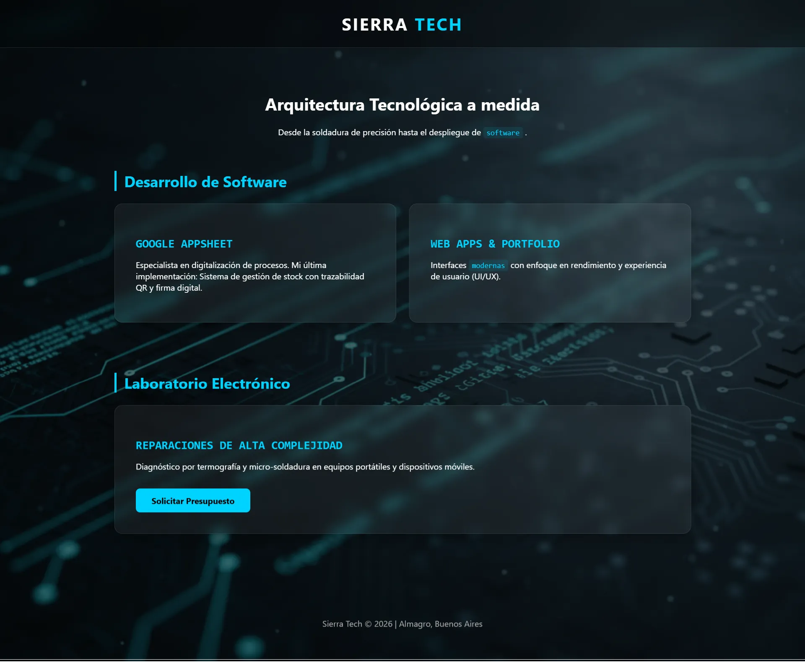

# Sierra Tech · Soluciones Tecnológicas Integrales

> **"De los fierros al código."**
> Arquitectura tecnológica a medida: desde la micro-soldadura hasta el despliegue de software.


<p align="center">
  
</p>

Sitio en producción: **[lautaro1393.github.io/SierraTech-lab](https://lautaro1393.github.io/SierraTech-lab/)**

---

## Sobre el proyecto

Este repositorio aloja el código fuente del sitio web oficial de **Sierra Tech**, un laboratorio de tecnología ubicado en Almagro, Buenos Aires.

El proyecto refleja la propuesta híbrida de la marca: diagnóstico y reparación electrónica a nivel componente, combinado con desarrollo de software a medida (web estática, automatización con AppSheet).

La estética es **glassmorphism** adaptado a la paleta "Sierra Industrial" (verde acid `#2EDC1B` sobre fondos dark/light), con foco en tipografía técnica y precisión visual.

## Stack técnico

Sin build step, sin dependencias npm, sin framework. Costo de mantenimiento = bajo.

- **HTML5 semántico** con ARIA solo donde el rol nativo no alcanza.
- **CSS3** con design system basado en tokens (`--accent`, `--surface`, `--space-*`, `--radius-*`).
- **JavaScript vanilla** en IIFE strict, ~17 KB. Fetch dinámico de `data/portfolio.json`.
- **Tipografía**: Space Grotesk (display), Geist (body), JetBrains Mono (UI técnica) — cargadas desde Google Fonts.
- **Glassmorphism** con `backdrop-filter` y fallbacks para `prefers-reduced-transparency` y navegadores sin soporte.
- **Datos externos**: `data/portfolio.json` con shape versionado, validado en runtime.
- **Deploy**: GitHub Pages, push-to-main, sin CI.

## Estructura del repo

```
SierraTech-lab/
├── index.html              Home con todas las secciones
├── 404.html                Página de error con la misma marca
├── styles.css              Design system + componentes (27 KB)
├── script.js               Interactividad (17 KB)
├── data/
│   └── portfolio.json      6 repairs + 1 proyecto software
├── img/                    Assets renombrados con slugs semánticos
│   ├── hero-bg.webp
│   ├── logo.svg · favicon.svg · og-cover.svg
│   ├── preview.webp
│   ├── Reparaciones/       10 fotos de repairs
│   └── proyectos/          Covers de proyectos software
├── robots.txt
├── sitemap.xml
├── .nojekyll
├── spec.md                 Especificación funcional
├── design.md               Design system (tokens, componentes)
└── PLAN.md                 Roadmap de ejecución
```

## Accesibilidad y performance

- **WCAG 2.1 AA** como estándar objetivo.
- Skip-link al inicio, foco visible con `--glow-accent`, ARIA tabs pattern, lightbox con focus trap.
- `prefers-reduced-motion` desactiva animaciones; `prefers-reduced-transparency` desactiva glass.
- `prefers-contrast: more` sube el contraste en ambos temas.
- Imágenes con `width`/`height` para evitar CLS; `loading="lazy"` en cards.
- JSON-LD `LocalBusiness` para SEO local.
- Meta tags OpenGraph y Twitter Card.

## Documentación

- [`spec.md`](./spec.md) — qué se construye (secciones, modelo de datos, comportamiento).
- [`design.md`](./design.md) — cómo se ve (tokens, componentes, motion, anti-patrones).
- [`PLAN.md`](./PLAN.md) — roadmap en 6 fases, con criterios de aceptación por fase.

## Servicios de Sierra Tech

### Reparación de alta complejidad
- Micro-soldadura SMD bajo microscopio.
- Reconstrucción de pistas quemadas.
- Limpieza química de sulfato.
- Cambio de pin de carga, conectores FPC, baterías.
- Mantenimiento preventivo de notebooks.

### Software a medida
- Sitios estáticos con HTML/CSS/JS vanilla.
- Despliegues en Vercel / GitHub Pages.
- Automatización con Google AppSheet: stock con QR, formularios, firma digital, tableros.

## Contacto

- **WhatsApp**: [+54 9 11 7826-7986](https://wa.me/5491178267986)
- **Email**: contacto@sierratech.lab
- **Ubicación**: Almagro, Buenos Aires, Argentina
- **GitHub**: [@Lautaro1393](https://github.com/Lautaro1393)

---

© 2026 Sierra Tech · Almagro, Buenos Aires. Todos los derechos reservados.
